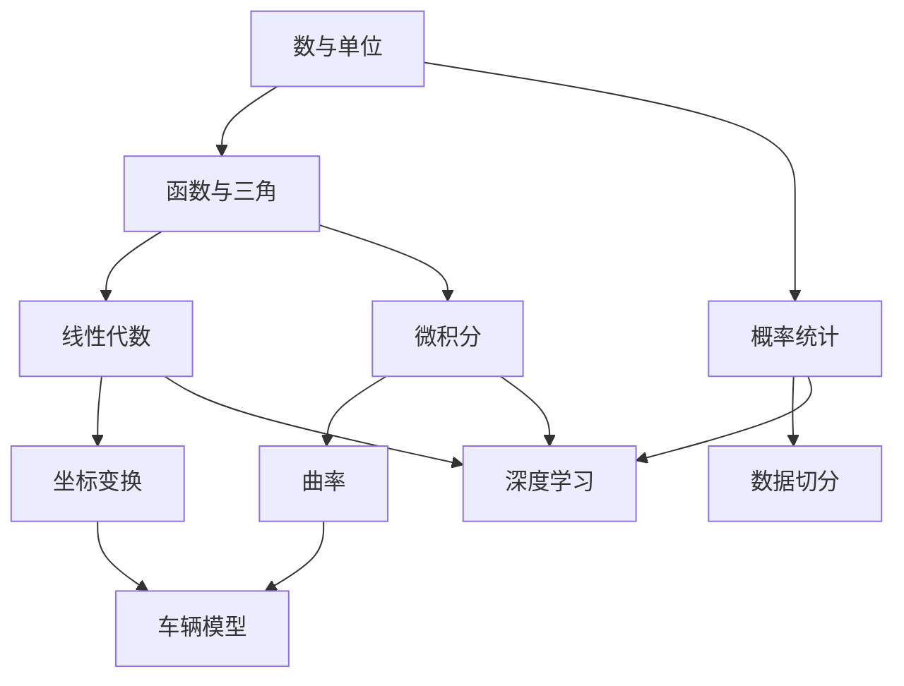
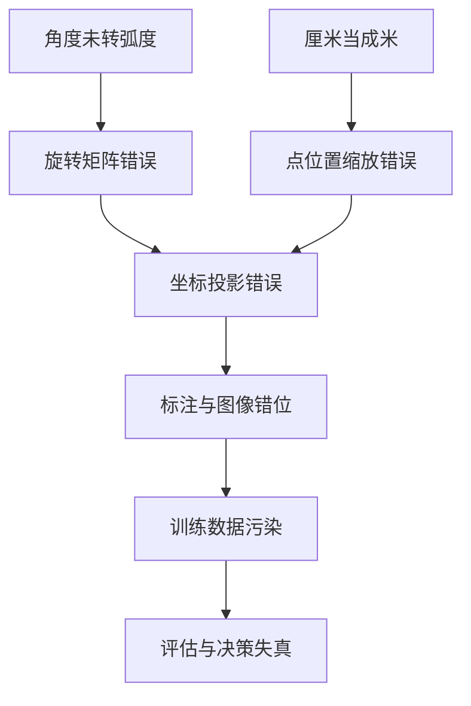

## 为什么先做数学诊断

这不是一场考试，也不用于给人贴上“数学好”或“数学差”的标签。它只回答一个工程问题：在学习坐标系、曲率、nuScenes 和深度学习之前，哪些基础已经稳固，哪些需要先补一小段。

自动驾驶数据里，同一个错误可能来自完全不同的基础缺口：

- 把角度直接传给只接受弧度的函数，会让旋转结果完全错误；
- 把厘米当成米，会让点云整体放大一百倍；
- 不理解数组的 `shape` 和 `axis`，可能把“按类别求和”写成“按样本求和”；
- 不理解条件概率，可能把“雨天时误检的概率”误读为“误检时一定是雨天”；
- 不理解变化率，后面就只能背曲率和梯度公式。

本课预计用时为 $60$–$90$ 分钟。先独立完成诊断，再查看解析。总分不是唯一标准：单位、角度、坐标方向和数组维度属于后续课程的安全地基，即使总分较高，这些题答错也要先补齐。

完成本课后，你应该能够：

1. 读懂常见数学符号，并把符号翻译成一句自然语言；
2. 在角度、弧度、米、秒等单位之间正确换算；
3. 根据函数图像解释“输入改变会怎样影响输出”；
4. 识别向量、矩阵和数组的形状；
5. 用均值、比例和条件概率描述一组简单数据；
6. 根据诊断结果选择补学内容，而不是盲目重学整本大学数学。



*车辆模型同时依赖坐标变换与曲率；整张图表示能力依赖，不表示必须学完全部数学才接触真实数据。*

## 课前诊断

### 作答规则

- 限时 $35$ 分钟；第一次作答不要查资料，也不要运行代码。
- 每题写出过程。只有答案、没有过程，不能判断你是理解还是猜中。
- 每题 $2$ 分，共 $24$ 分。
- 完成全部题目后，再看后面的解析并用另一种颜色订正。

### 题目

1. 一辆车以 $36\,\mathrm{km/h}$ 行驶。它的速度是多少 $\mathrm{m/s}$？

2. 已知 $3x+2=17$，求 $x$，并写出你对结果的代回检查。

3. 函数 $y=2x+1$ 中，当 $x$ 从 $3$ 增加到 $5$ 时，$y$ 增加多少？

4. 若某传感器每秒产生 $10^6$ 字节数据，连续运行 $10^2$ 秒会产生多少字节？写成科学计数法。

5. 将 $90^\circ$ 转换为弧度。若程序写成 `np.sin(90)`，为什么结果不会等于 $1$？

6. 车辆坐标系中规定 $x$ 轴朝前、$y$ 轴朝左。点 $P=(3,4)$ 的距离是多少？它位于车辆左前方还是右前方？

7. 为什么求点 $P=(x,y)$ 的方向角时，通常应使用 $\operatorname{atan2}(y,x)$，而不是 $\arctan(y/x)$？至少写出一个原因。

8. 向量 $\mathbf p=[2,3,1]^\mathsf T$ 有几个分量？矩阵 $A\in\mathbb R^{4\times3}$ 与 $\mathbf p$ 相乘后，结果是什么形状？

9. 一个相机批次的数组形状为 $(8,3,224,224)$。请分别解释四个维度最可能表示什么。如果对 `axis=0` 求均值，哪个维度会被消去？

10. 轨迹位置在 $t=1.0\,\mathrm{s}$ 时为 $2.0\,\mathrm{m}$，在 $t=1.1\,\mathrm{s}$ 时为 $2.6\,\mathrm{m}$。用差商估计这段时间的平均速度。

11. 数据集中有 $100$ 帧，其中 $20$ 帧为雨天；雨天帧中有 $8$ 帧图像质量不合格。随机抽取一帧，已知它是雨天时，图像质量不合格的经验概率是多少？

12. 两组延迟数据分别为 $A=[50,50,50]$ 毫秒和 $B=[30,50,70]$ 毫秒。两组均值是否相同？哪一组波动更大？

## 核心章节

### 1. 数、单位和量纲

数学表达式中的数字必须带着它的物理含义一起理解。速度换算不是背诵结论，而是让单位在式子中约掉：

$$
36\,\frac{\mathrm{km}}{\mathrm{h}}
\times
\frac{1000\,\mathrm m}{1\,\mathrm{km}}
\times
\frac{1\,\mathrm h}{3600\,\mathrm s}
=10\,\frac{\mathrm m}{\mathrm s}.
$$

以后看到公式时，先问三个问题：

- 输入是什么单位？
- 输出应该是什么单位？
- 等式两边量纲是否一致？

例如曲率的单位是 $\mathrm{m}^{-1}$，因为曲率半径 $R$ 的单位是米，并且

$$
\kappa=\frac{1}{R}.
$$

### 2. 变量、方程和函数

变量表示一个可以变化或尚未知的量。函数表示输入和输出之间的确定关系：

$$
y=f(x).
$$

读作“把 $x$ 输入函数 $f$，得到 $y$”。在自动驾驶数据中，函数并不神秘：

- 输入时间 $t$，输出车辆位置 $x(t)$；
- 输入点坐标 $\mathbf p$，输出变换后的坐标 $T\mathbf p$；
- 输入图像 $\mathbf X$ 和模型参数 $\theta$，输出类别概率 $f_\theta(\mathbf X)$。

### 3. 角度、弧度和三角函数

一整圈既可以表示为 $360^\circ$，也可以表示为 $2\pi$ 弧度，因此

$$
\theta_{\mathrm{rad}}=\theta_{\mathrm{deg}}\frac{\pi}{180}.
$$

Python 和 NumPy 的三角函数默认接收弧度。$90$ 会被解释为 $90$ 弧度，而不是 $90^\circ$。正确写法是：

```python
theta = np.deg2rad(90.0)
value = np.sin(theta)
```

$\operatorname{atan2}(y,x)$ 同时利用 $x$ 和 $y$ 的符号，可以区分四个象限，也能处理 $x=0$。单独计算 $\arctan(y/x)$ 会丢失这些信息。

### 4. 下标、求和与平均

$x_i$ 表示一组数据中的第 $i$ 个元素。$n$ 个数的平均值为

$$
\bar x=\frac{1}{n}\sum_{i=1}^{n}x_i.
$$

符号 $\sum$ 只是“按指定范围逐项相加”的紧凑写法。后面的概率、损失函数和张量归约都会反复使用它。

### 5. shape、axis 和数学对象

一个标量没有方向；一个向量是一列有序分量；一个矩阵是二维数表；更高维数组通常称为张量。

对形状为 $(8,3,224,224)$ 的图像批次，常见约定是：

$$
(N,C,H,W)=(8,3,224,224),
$$

分别表示批次、通道、高度和宽度。沿 `axis=0` 求均值会聚合 $8$ 张图像，结果形状变为 $(3,224,224)$。

### 6. 变化率与不确定性

短时间内的平均速度可以用差商近似：

$$
v\approx\frac{\Delta x}{\Delta t}
=\frac{2.6-2.0}{1.1-1.0}
=6\,\mathrm{m/s}.
$$

条件概率强调“条件已经给定”。在 $20$ 帧雨天数据中有 $8$ 帧不合格，因此

$$
P(\text{不合格}\mid\text{雨天})\approx\frac{8}{20}=0.4.
$$

它不等于 $P(\text{雨天}\mid\text{不合格})$。条件的位置不能随意交换。



*基础错误会沿数据链放大，所以单位和角度检查必须放在计算入口。*

## 逐步例题：从一个点读出距离与方向

车辆坐标系中 $x$ 轴朝前、$y$ 轴朝左，点为

$$
P=(3,4)\,\mathrm m.
$$

第一步，计算到原点的距离：

$$
r=\sqrt{x^2+y^2}
=\sqrt{3^2+4^2}
=5\,\mathrm m.
$$

第二步，根据两个坐标的符号判断象限。$x>0$ 表示前方，$y>0$ 表示左侧，所以该点在左前方。

第三步，计算方向角：

$$
\theta=\operatorname{atan2}(4,3)\approx0.927\,\mathrm{rad}.
$$

第四步，为了便于人阅读，将弧度转换为角度：

$$
\theta_{\mathrm{deg}}
=0.927\frac{180}{\pi}
\approx53.13^\circ.
$$

第五步，做合理性检查：$y>x>0$，所以角度应在 $45^\circ$ 与 $90^\circ$ 之间；$53.13^\circ$ 符合直觉。

这个小例子同时用到了单位、平方根、坐标方向、三角函数和合理性检查，后面的坐标变换会在此基础上继续。

## 引导实验：建立数学就绪 Notebook

新建一个 Notebook，逐格运行下面的代码，并在每格下面用一句话解释输出。

```python
import numpy as np

#1. 单位换算
speed_kmh = 36.0
speed_ms = speed_kmh * 1000.0 / 3600.0
assert np.isclose(speed_ms, 10.0)

#2. 角度与弧度
theta_deg = 90.0
theta_rad = np.deg2rad(theta_deg)
assert np.isclose(np.sin(theta_rad), 1.0)

#3. 点的距离和方向
p = np.array([3.0, 4.0])
distance = np.linalg.norm(p)
heading_rad = np.arctan2(p[1], p[0])
heading_deg = np.rad2deg(heading_rad)
assert np.isclose(distance, 5.0)

#4. shape 与 axis
images = np.zeros((8, 3, 224, 224), dtype=np.float32)
mean_image = images.mean(axis=0)
assert mean_image.shape == (3, 224, 224)

#5. 均值和波动
latency_a = np.array([50.0, 50.0, 50.0])
latency_b = np.array([30.0, 50.0, 70.0])
print(latency_a.mean(), latency_a.std())
print(latency_b.mean(), latency_b.std())
```

然后完成三个小改动：

1. 把点改为 $(-3,4)$，先手写它所在的方向，再运行代码验证；
2. 分别对图像数组的 `axis=1`、`axis=2` 求均值，记录输出 shape；
3. 把速度换成 $72\,\mathrm{km/h}$，不看原公式独立完成换算。

## 独立任务：一页数学基础画像

独立提交一个 Notebook 或 Markdown 报告，内容包括：

1. 十二道诊断题的首次答案、订正和错误原因；
2. 对数据 `latency_ms = [48, 53, 51, 120, 49]` 计算均值、最小值、最大值和标准差；
3. 解释为什么 $120\,\mathrm{ms}$ 可能值得单独检查；
4. 对四个点 $(3,4)$、$(-3,4)$、$(-3,-4)$、$(3,-4)$ 计算距离和方向角；
5. 写出你最薄弱的两个知识点和具体补学动作；
6. 写出一个你仍然不确定的问题，供导师下一次讲解。

禁止只提交运行结果截图。必须保留代码、公式、单位和解释。

## 常见错误案例

### 把角度直接传入三角函数

错误：`np.cos(90)`。

原因：NumPy 把 $90$ 解释为弧度。修复方法是先明确单位，再调用 `np.deg2rad`。

### 只写数字，不写单位

“速度是 $10$”无法判断是 $\mathrm{m/s}$ 还是 $\mathrm{km/h}$。工程结果必须带单位。

### 使用 $\arctan(y/x)$ 求方向

这会在 $x=0$ 时除零，并且无法可靠区分象限。应使用 $\operatorname{atan2}(y,x)$。

### 混淆数组的 axis

`axis=0` 不是固定表示“行”或“样本”，它表示第零个维度。必须先写出 shape 和每个维度的语义。

### 认为均值相同就代表数据相同

$[50,50,50]$ 和 $[30,50,70]$ 的均值相同，但波动完全不同。数据质量不能只看一个平均值。

### 把条件概率的条件交换

$P(A\mid B)$ 与 $P(B\mid A)$ 回答的是两个不同问题，不能因为符号相似而互换。

## 需要提交的证据

- 原始诊断答案及用时；
- 逐题订正和错误原因分类；
- 可从头运行的 Notebook；
- 所有物理量的单位；
- 数组 shape 和 axis 的解释；
- 一页个人补学计划；
- 至少一个由自己提出的问题。

建议把错误分为“概念不懂、计算失误、符号误读、单位遗漏、代码维度错误”五类。导师应依据错误类型安排补学，而不是只看总分。

## 0–3 级验收量表

| 等级 | 表现 | 导师判断 |
|---:|---|---|
| 0 | 无法解释变量、单位、角度或 shape；答案主要靠猜 | 尚未具备进入数学主线的条件 |
| 1 | 在提示下能完成单一步骤，但会混淆单位、象限或 axis | 先完成针对性补缺，再复测 |
| 2 | 能独立完成诊断、代码验证和错误订正；关键题无单位与坐标错误 | 可以进入线性代数、微积分和概率核心课 |
| 3 | 不仅能独立完成，还能解释为什么常见错误会发生，并设计检查方法 | 可以帮助同伴复核基础结果 |

通过门槛：总分至少 $19/24$，并且第 1、5、7、8、9 题均达到等级 2。若总分达标但关键题未达标，只补相应知识，不需要重学全部内容。

## 来源与延伸阅读

- [《动手学深度学习》第二版：预备知识](https://zh-v2.d2l.ai/chapter_preliminaries/index.html)：用于连接数据操作、线性代数、微积分和概率的整体位置。
- [NumPy：数组基础](https://numpy.org/doc/stable/user/absolute_beginners.html)：用于复习数组、shape、axis 和基本运算。
- [NumPy：三角函数](https://numpy.org/doc/stable/reference/routines.math.html#trigonometric-functions)：核对弧度输入和反三角函数接口。

本课根据后续自动驾驶数据任务重新组织示例和验收要求，参考资料用于延伸阅读，不替代独立讲解与练习。
