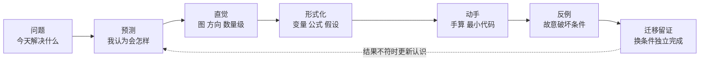
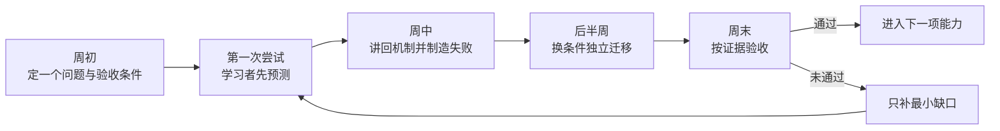

## 嗨，先别急着研究整张路线

第一次打开知识库时，你可能会看到很多陌生词：矩阵、坐标系、scene、曲率、梯度、ROS 2。**不认识它们很正常，这正是你来这里的原因。**

你不需要先读完目录，也不需要证明自己“基础够好”。今天只做三件事：

1. 选一个你现在最想解决的小问题；
2. 用自己的话猜一下答案，不会就写“不知道”；
3. 跟着页面手算或运行一个最小例子，把结果保存下来。

做到这里，今天就算有进展。不要为了“看完一课”一直往下滚。

> **导师想对你说：** 这里允许你慢一点、问看起来很基础的问题，也允许第一次做错。请把“不懂发生在哪里”说清楚；这比假装听懂更有价值。

### 你现在是哪一种情况

| 如果你现在…… | 先做什么 | 暂时不用做什么 |
|---|---|---|
| 完全不知道从哪开始 | 打开数学起点导航，只做会做的题 | 不用从第一门课一路读到底 |
| 已经接到 nuScenes 数据任务 | 先把数据集当成一本多传感器行车记录册，认识 scene、sample、token | 不用立刻背完整数据表关系 |
| 被坐标或矩阵卡住 | 先画“传感器—车辆—地图”三套坐标轴，再移动一个点 | 不用先推导四元数和李群 |
| 被曲率或车辆模型卡住 | 先比较直线、大圆和小圆谁弯得更急 | 不用先背连续曲率公式 |
| 代码报错 | 只保留最小输入，记录 shape、单位、报错和你刚改了什么 | 不要同时换数据、版本和算法 |

### 一次只学 45–60 分钟

前 10 分钟用来弄清问题和画图，中间 25 分钟只做一个手算或最小代码，最后 10 分钟换一个数字再做一次。还没完成整课没有关系，下次从同一位置继续。

## 先跟我做一个 5 分钟的小例子

问题：车辆速度是 $36\,\mathrm{km/h}$，换成 $\mathrm{m/s}$ 是多少？

### 1. 先猜，不怕错

先不计算。你觉得答案比 $36$ 大还是小？因为“每小时”换成了更短的“每秒”，数值应该变小。能先判断方向，就不容易把换算写反。

### 2. 让单位自己约掉

我们希望最后只剩下 $\mathrm{m/s}$：

$$
36\,\frac{\mathrm{km}}{\mathrm h}
\times\frac{1000\,\mathrm m}{1\,\mathrm{km}}
\times\frac{1\,\mathrm h}{3600\,\mathrm s}
=10\,\frac{\mathrm m}{\mathrm s}.
$$

把相同的 $\mathrm{km}$ 和 $\mathrm h$ 上下约掉，最后正好只剩米和秒。这里不是背“除以 3.6”，而是在检查单位有没有走到正确方向。

### 3. 故意试一个错误

如果误写成乘以 $3.6$，会得到 $129.6\,\mathrm{m/s}$，约等于每小时 $466\,\mathrm{km}$。一辆普通道路车辆显然不合理，所以“数量级检查”能在代码运行前提醒我们。

### 4. 换一个数字，自己再做一次

现在把 $36\,\mathrm{km/h}$ 换成 $72\,\mathrm{km/h}$。先猜，再按单位换算；你应该得到 $20\,\mathrm{m/s}$。

这就是整套知识库的学习方式：先猜趋势，用最小例子理解，再故意试错，最后换条件独立完成。

## 做完第一小步，再理解这套系统怎么工作

这不是一组必须按顺序点开的知识卡，也不是要求一次读完的百科全书。你先遇到一个真实问题，再只学习解决它所需的最小知识，最后换一个条件独立做一次，确认自己不是只会照着页面操作。

继续学习时，记住三条规则：

1. 不要急着看答案。先写下你现在怎么想，以及你预测会发生什么。
2. 不要一开始运行完整数据集。先让一个公式、三个点、两帧数据或一个 batch 工作起来。
3. “代码能跑”只是第一步。能解释一次失败、换条件再做一次，才说明你真的理解了。

> **安全边界：** “反例”和“故意犯错”只允许在纸面、Notebook、沙箱、复制数据或离线回放中进行。不要在真实车辆、生产数据、公司主机、在线 ROS 图或 CAN 硬件接口上制造故障；这类环境只做课程明确允许的只读检查。

*学习不是把答案搬进记忆，而是让“预测—观察—修正”的循环越来越可靠。*

## 一节课的七步认知闭环

| 步骤 | 你要问自己的问题 | 页面上的动作 | 完成证据 |
|---|---|---|---|
| 1. 问题 | 今天到底要解释、计算或判断什么？ | 把本课目标改写成一个可检查的问题 | 一句话的问题定义 |
| 2. 预测 | 在看答案前，我认为结果会怎样？为什么？ | 有课前诊断时先完成；否则直接写已有认识和不确定点 | 一条带理由的预测 |
| 3. 直觉 | 改变方向、大小或极端条件，趋势会怎样？ | 看图、画图、估数量级，用自己的话讲一遍 | 一张草图或口头讲回 |
| 4. 形式化 | 每个符号代表什么？单位、坐标系和假设是什么？ | 阅读定义与推导，把公式翻译成自然语言 | 符号、输入、输出和边界说明 |
| 5. 动手 | 最小例子能否与手算结果一致？ | 先手算，再运行最小代码 | 输入、命令、输出与对照结果 |
| 6. 反例 | 破坏一条假设后，错误怎样传播？ | 故意交换顺序、混用单位、制造泄漏或改错 shape | 失败样本、原因与检查方法 |
| 7. 迁移留证 | 换一个条件后，我还能独立完成吗？ | 移除逐步提示，用新数据或参数重做 | 可复现产物与认识更新 |

预测可以错，但不能省略。错误预测会暴露真正的认知缺口；直接照着答案操作，只能证明你能跟做。

> 推荐句式：我认为 ______；当 ______ 改变时，我预测 ______，因为 ______。

### 可复制的学习卡

每次学习只维护一张卡：

- 本课问题：
- 我现在认为：
- 我的预测与理由：
- 直觉图、方向或数量级：
- 正式定义、公式与假设：
- 最小实验及输入：
- 我故意改错了：
- 错误为何发生、怎样更早发现：
- 我更换了什么条件：
- 证据保存在哪里：
- 这次更新了什么认识：

## 适用时使用双轨动手：从零实现，再用工具实现

本系统借鉴 [《动手学深度学习》中文教材](https://zh-v2.d2l.ai/) 的章节式学习和“从零实现—简洁实现”思路，也参考其[在线课程](https://courses.d2l.ai/zh-v2/)把算法、PyTorch 与真实数据实践结合起来。数学、坐标、曲率、数据算法和模型课程适合采用下面的双轨方法；系统总览、硬件网络、证据方法和只读排障课程则以画清契约、复现观察和解释证据为主，不要求“从零实现”系统。

| 第一遍：看清机制 | 第二遍：接近工程 |
|---|---|
| 用手算、少量点或 NumPy 写出最小过程 | 用 PyTorch、nuScenes SDK 或工程工具重做 |
| 每一步都能解释输入和输出 | 记录版本、配置、运行命令和产物 |
| 适合发现矩阵顺序、符号和梯度来源 | 适合检查数据契约、性能与复现性 |

两遍结果必须能对照。工具实现更短，不代表可以跳过机制；从零实现更透明，也不代表它就是最终工程方案。

## 一次 45–60 分钟怎样安排

| 时间 | 动作 | 不可删除的输出 |
|---|---|---|
| 0–5 分钟 | 明确今天只解决的一个问题 | 问题定义 |
| 5–10 分钟 | 不查答案，写已有认识与预测 | 预测与理由 |
| 10–17 分钟 | 看图、方向、趋势和数量级 | 一句直觉解释 |
| 17–27 分钟 | 学定义、公式、变量和假设 | 符号翻译与边界 |
| 27–40 分钟 | 手算一次，再运行最小实验 | 输入、代码、输出 |
| 40–47 分钟 | 故意破坏一个条件 | 失败现象与原因 |
| 47–55 分钟 | 换条件独立完成 | 迁移结果 |
| 55–60 分钟 | 保存证据并复盘 | 认识更新 |

如果只有 45 分钟，可以缩小阅读范围和实验规模，但不要删除“预测、反例、迁移、留证”四个环节。复杂课程由多次这样的学习单元组成，不要求一次看完。

## 完整路线怎么用：每次只看下一步

主线是：

> P0 起点与工具 → M1 数学核心 → A1 自动驾驶数据 → DL 深度学习 → P4 工程交付

E1 ROS 2 与 Autoware、E2 车辆几何与控制是按任务进入的拓展线。课程编号只是方便查找，不代表必须从第一门读到最后一门；选择下一课时，只看“我现在要解决什么”和“开始前最好会什么”。

| 阶段 | 这一段解决什么 | 学完后可以做到什么 |
|---|---|---|
| P0 起点导航与数字工具 | 找到下一小步，建立安全、可复现的工作方式 | 写一份自己的补课清单，并跑通最小脚本 |
| M1 数学核心 | 给坐标、曲率、数据切分和训练建立共同语言 | 手算、NumPy 验证与误差解释 |
| A1 自动驾驶数据主线 | 把数学落到传感器、坐标链和 nuScenes 任务 | inventory、split、QC、可视化、dataset card |
| DL 深度学习与计算机视觉 | 从训练闭环走向视觉数据项目 | 训练脚本、曲线、指标与失败样本 |
| E1 ROS 2 与 Autoware | 理解运行图和数据断链 | 只读断链报告 |
| E2 车辆几何与控制 | 推导曲率、车辆模型与接口边界 | 轨迹仿真、数值边界分析与离线 CAN 解码 |
| P4 工程交付与验证 | 把结果组织成别人可复现的交付 | manifest、验证报告与限制说明 |

课程卡片上的三个状态只表示“现在能不能跟着学”：

- **可以开始**：有老师式开场、图和最小例子，可以直接跟着做；
- **可以阅读**：知识已经在，但讲解还会继续变得更适合新手；
- **正在准备**：先让你知道以后会学什么，现在不用点开。

## 导师与实习生的一周

*导师负责确定问题、安全边界和验收条件；学习者必须先预测、再实验，最后用证据讲回。*

### 周初：只定一项能力

不要把目标写成“学完一章”。写成“本周能独立完成一次 sensor→ego 坐标变换，并用往返测试发现矩阵方向错误”这类可观察结果，同时约定交付物、允许使用的数据和安全边界。

### 周中：讲回与主动失败

学习者不用课文，用自己的话解释机制，然后故意破坏一条假设。导师重点追问：错误出现在哪里，为什么输出仍可能看起来合理，哪条检查能更早发现它。

### 周末：看看自己是不是真的会了

固定看四件事：能不能用自己的话解释、能不能独立做一次、别人能不能复现、出错后能不能找到原因。做出一个结果不等于已经理解；如果还不会，也不用推倒重学，只补卡住的那一小块。

## 前四周的零基础起步路线

下面按每周约 8–10 个、每个 45–60 分钟的学习单元安排。每周列的是主要焦点，不表示必须在一周内完成整门长课；线性代数、微积分和概率论可以跨周推进。若可用时间更少，就顺延，不压缩认知闭环。

### 第 1 周：知道自己从哪里开始

- 课程：数学起点导航；零基础预备课中与你当前缺口对应的部分。
- 核心问题：哪些单位、函数、数组和 Python 基础会阻塞后续数据任务？
- 产物：诊断 Notebook、个人补课清单、第一张学习卡。

### 第 2 周：让别人复现一次最小数据操作

- 课程：远程运维与开发工具、证据优先的工程排障中与本周任务直接相关的章节。
- 核心问题：脚本除了“运行成功”，还要留下什么，别人才能复现？
- 产物：沙箱中的最小脚本、输入输出与环境记录、一次故意路径或版本错误。

### 第 3 周：开始建立坐标变换地基

- 课程：开始“线性代数：从向量到坐标变换”；长课未完成时延续到下一周。
- 核心问题：同一个点为什么会有不同坐标？传感器点怎样进入车辆坐标？
- 阶段产物：一次手算、最小 NumPy 变换函数、一次正逆往返测试，以及沙箱中的矩阵顺序或角度单位错误实验。

### 第 4 周：继续坐标地基，并开始理解数据切分

- 课程：完成线性代数当前最小迁移任务；开始“概率论：从随机性到场景切分”。
- 核心问题：为什么连续自动驾驶数据不能简单按帧随机切分？
- 阶段产物：一版最小 scene-level split、随机种子和集合互斥检查；在复制元数据中完成一次故意泄漏实验。完整数据质量报告可在后续学习单元继续完善。

四周结束只是完成起步，不代表数学核心已经通过。后续按真实依赖推进：

- 线性代数完成后即可进入正式坐标转换，不必等待微积分；
- nuScenes 数据任务还需要概率论、坐标转换，以及“自动驾驶系统总览 → 感知算法与地图基础”；
- 深度学习训练闭环需要线性代数、微积分与概率论三门数学核心。

## 怎样判断自己真的完成了

阅读页面只表示接触过知识；跑通示例只表示完成跟做。换一组条件还能独立完成、解释一次故意错误，并让别人按记录复现，才说明你真的会了。导师会和你一起确认：继续下一步，还是只补卡住的那一小块。

学习方法可以公开，但实习生姓名、作业、评分、内部数据和工程证据必须保存在私有位置。
